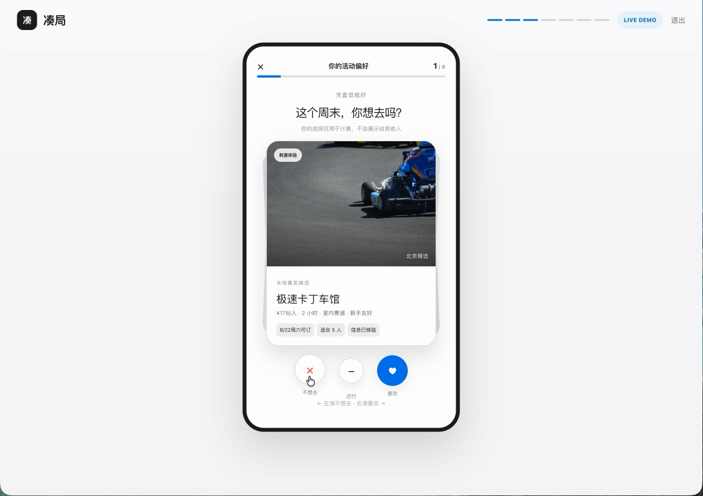

# 凑局 Couju — Group Decision OS

> 把群聊里的“都行”，变成马上能执行的共同决定。

[在线体验 Interactive Demo](https://couju-demo.quintinwei1314.chatgpt.site/) · 2–6 人本地聚餐 / 活动决策 · 移动端与桌面端均可体验

> [!IMPORTANT]
> 当前项目仅用于作品集与 Demo 展示，尚未接入任何真实 API Key。候选数据、AI 偏好抽取与推荐流程均为本地预置或模拟结果，不代表已接入实时商户、地图或线上大模型服务。

## 演示视频

[](https://github.com/QuintinWei/couju-group-decision-os/raw/main/docs/assets/couju-demo.mp4)

[点击播放 / 下载 45 秒产品演示视频](https://github.com/QuintinWei/couju-group-decision-os/raw/main/docs/assets/couju-demo.mp4)

## 作品简介

凑局是一款 AI 群体决策产品。它不是再给一个人生成一份推荐清单，而是帮助 2–6 个人在预算、时间、距离、忌口和兴趣不同的情况下，快速找到一个“所有硬约束都满足、没有人明显被牺牲”的共同方案。

核心闭环：

```text
创建房间 → 私密滑卡 → AI 理解自然语言底线 → 硬约束过滤
→ FairMix 公平共识排序 → 全员接受 / 否决重排 → 锁定行动卡
```

## 可交互 Demo

打开：[https://couju-demo.quintinwei1314.chatgpt.site/](https://couju-demo.quintinwei1314.chatgpt.site/)

推荐演示路径：

1. 点击「体验完整决策」。
2. 选择「一起聚餐」或「周末活动」。
3. 修改城市、日期、开始 / 结束时间和 2–6 人规模。
4. 进入房间，完成 8 张带真实场景图片的私密滑卡。
5. 设置预算、通勤和饮食 / 空间底线，并输入一句自然语言偏好。
6. 查看结构化标签回显，确认后启动 FairMix 求交集。
7. 查看 Top 3、Group Fit 与推荐依据。
8. 可直接接受，也可否决并选择原因，观察系统重排。
9. 全员确认后锁定方案，体验导航、日历与分享动作。

当前 Demo 包含：

- 城市、日期、时间窗与人数的真实表单交互；
- 聚餐与活动两套完全独立的候选和结果链路；
- 16 个带场景图片的本地候选；
- 鼠标 / 触摸滑卡与按钮双交互；
- 自然语言偏好 → 结构化约束的确认界面；
- 候选过滤、FairMix 排序、Top 3 对比；
- 接受、可接受、否决、动态重排；
- 最终行动卡、地图导航和 `.ics` 日历文件生成。

## 为什么这是 AI 产品，而不只是投票工具

AI 负责理解低成本、非结构化的人类表达，并把它整理成可确认的结构化约束；最终决定不交给语言模型“凭感觉”生成，而由可测试、可复现的确定性算法完成。

| 模块 | 方法 | 作用 |
|---|---|---|
| Preference Extractor | LLM + Structured Output | 把“我 17 点后才到，不想排队”抽取为时间硬约束和排队软偏好 |
| Candidate Retriever | 候选库 / 地点工具 | 找到城市、日期和人数匹配的真实候选 |
| Feasibility Checker | 规则 | 校验时间、预算、距离、忌口等硬约束 |
| FairMix Engine | 确定性代码 | 保护最低个人效用，兼顾群体均值和最大后悔值 |
| Explanation Writer | LLM + 只读算法证据 | 把排名依据转成简短、可解释且不泄露个人隐私的文案 |
| Action Connector | 地图 / 日历深链 | 把推荐变成现实行动 |

详细 Prompt、输入 / 输出和降级策略见 [AI 工作流说明](docs/AI_WORKFLOW.md)。

## AI 工作流示例

用户输入：

```text
我 17:00 后才到，晚上 8 点前得走，不想排队。
```

结构化输出：

```json
{
  "hard_constraints": [
    { "type": "arrival_after", "value": "17:00", "confidence": 0.99 },
    { "type": "leave_before", "value": "20:00", "confidence": 0.99 }
  ],
  "soft_preferences": [
    { "feature": "queue_time", "direction": "minimize", "weight": 0.7, "confidence": 0.82 }
  ],
  "needs_confirmation": true
}
```

用户确认标签后，硬约束进入候选过滤，软偏好进入个人效用计算；模型无权自行把软偏好升级为硬约束。

## FairMix 公平共识

普通投票容易让多数人的最爱变成少数人的雷区。凑局先淘汰违反任意成员硬约束的候选，再综合：

```text
Score = 0.40 × 最低个人效用
      + 0.30 × 几何平均效用
      + 0.20 × 平均效用
      + 0.10 × (1 - 最大后悔值)
      - 0.10 × 数据不确定性
```

`Group Fit` 只用于同一会话内排序，不包装成“成功概率”。

## 隐私与可信度

- 偏好、预算和忌口默认私密；小组只看到完成进度和群体结论。
- 结果解释只使用匿名群体汇总，不显示“谁导致了哪个限制”。
- 过敏、无障碍、明确时间等硬约束不会被平均分抵消。
- 无可行候选时不伪造答案，而是提出一个成本最低的私密澄清问题。
- Prompt 和 Schema 需要版本化；算法结果可回放、可测试。

## Demo 实现边界

为了保证作品展示无需 API Key、网络波动时仍可完整体验，当前公开 Demo 使用精选本地候选、预置结构化抽取结果与确定性重排流程。生产版本的 LLM 接入点、Prompt、JSON 输出契约和规则回退已在 `docs/AI_WORKFLOW.md` 中定义。

这意味着：Demo 展示的是完整产品交互与 AI 工作流效果；外部事实、实时多人同步和线上 LLM 调用属于下一阶段接入项，不在页面中伪装为已上线能力。

## 技术栈

- Next.js / React 19 / TypeScript
- Vinext + Cloudflare Runtime
- 原生 CSS 响应式界面
- 本地结构化候选数据与图片资源
- Node Test + production build verification

## 本地运行

要求 Node.js `>= 22.13.0`。

```bash
npm install
npm run dev
```

构建与验证：

```bash
npm run build
npm test
```

## 项目结构

```text
app/page.tsx              完整交互状态机与 Demo 数据
app/globals.css           Apple-inspired 响应式视觉系统
public/candidates/        聚餐与活动场景图片
docs/AI_WORKFLOW.md       AI 架构、Prompt、输入 / 输出、降级策略
tests/                    构建与页面渲染测试
```

## 项目状态

当前版本为可路演的交互式 MVP Demo。下一阶段将接入真实 LLM Structured Output、地点 / 路线 API、多人实时房间和服务端 FairMix 模块。
